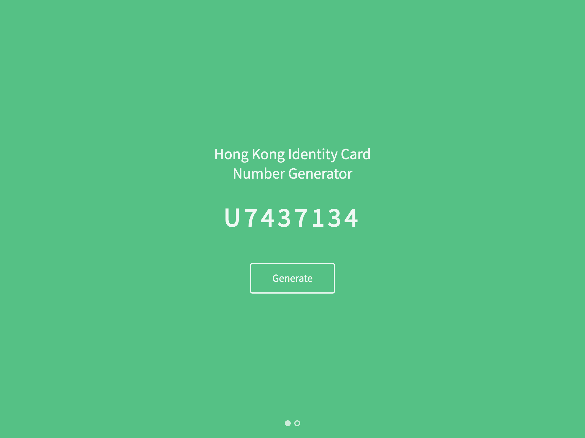

# Hong Kong Identity Card Number Generator and Validator #

Progressive Web Application for generates or validates Hong Kong Identity Card number.

## Preview Screens ##

## Setup ##
Below shows some basic setup steps.

### Node version ###
This project is developed using Node.js 10. The version is already specified in the `.nvmrc` file. Suggest to run `nvm use` when you enter the project folder.

### Install packages need for the project ###
Install npm packages in project root folder first using `npm install`.

### To start the project ##
Run `npm dev` in project root folder.

### To build production ###
Run `npm build` in project root folder.

## Configurations ##
Below shows some available configuration options.

### To add / edit Webpack alias ###
To add or edit Webpack alias, modify `resolve.alias` in `webpack/webpack.base.conf.js`.
